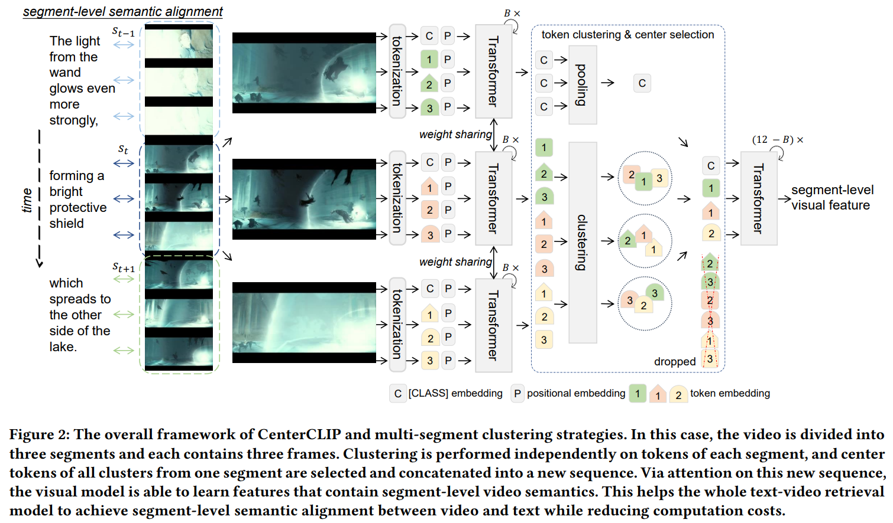
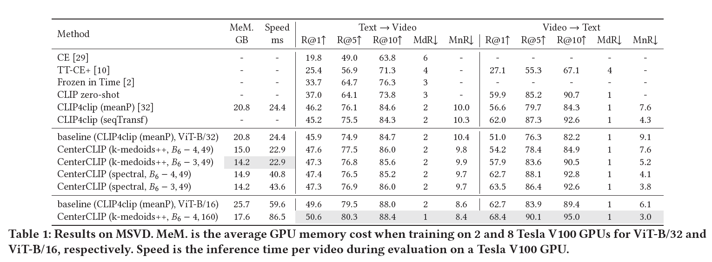
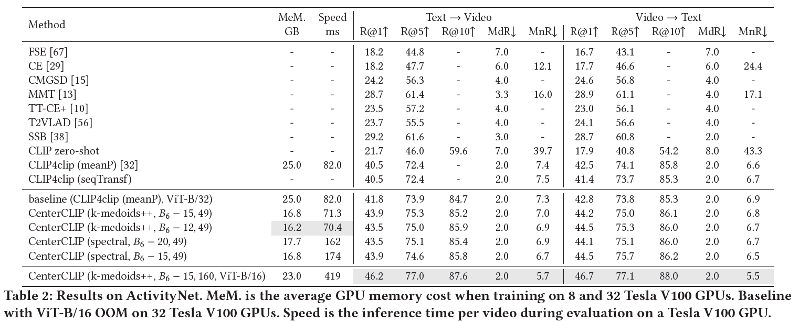
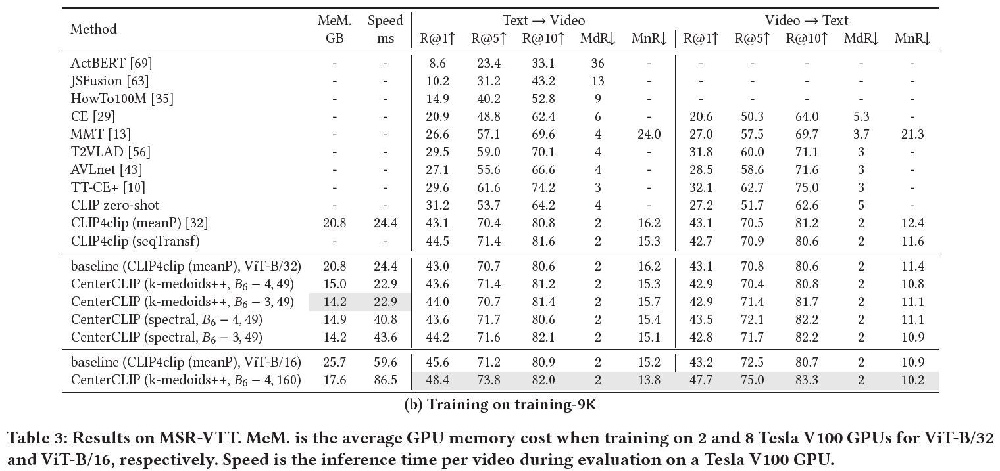
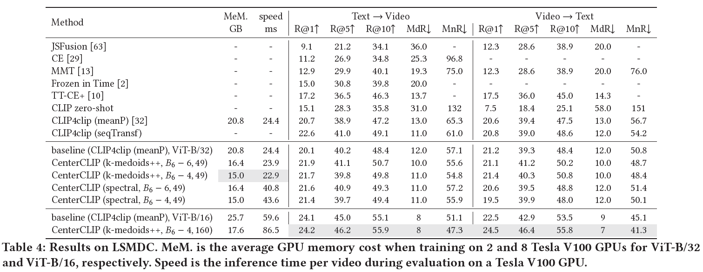

[](https://creativecommons.org/licenses/by-nc/4.0/)
[](https://arxiv.org/abs/2205.00823)

[](https://paperswithcode.com/sota/video-retrieval-on-activitynet?p=centerclip-token-clustering-for-efficient)

[](https://paperswithcode.com/sota/video-retrieval-on-msvd?p=centerclip-token-clustering-for-efficient)

[](https://paperswithcode.com/sota/video-retrieval-on-lsmdc?p=centerclip-token-clustering-for-efficient)

[](https://paperswithcode.com/sota/video-retrieval-on-msr-vtt-1ka?p=centerclip-token-clustering-for-efficient)


# CenterCLIP

CenterCLIP achieves state-of-the-art text-video retrieval performance
and decent computation cost reduction on MSVD, MSRVTT, LSMDC, and ActivityNet through performing multi-segment token clustering on video tokens in the vision transformer of CLIP.


##  Table of Contents

<!--ts-->
* [Introduction](#Introduction)
* [Features](#Features)
* [Results](#Results)
* [Installation](#Installation)
* [Training](#Training)
* [Checkpoints](#Checkpoints)
* [Citations](#Citations)
* [Licenses](#Licenses)
* [Acknowledgements](#Acknowledgements)
<!--te-->


## News

- [02/05/2022] create repo.


## Introduction

<div align="justify">

This is the code for the paper 
<a href="https://arxiv.org/abs/2205.00823">
CenterCLIP: Token Clustering for Efficient Text-Video Retrieval.
</a>
<br />
	In this work, to reduce the number of redundant video tokens,
	we design a multi-segment token clustering algorithm
	to find the most representative tokens and drop the non-essential ones.
	As the frame redundancy occurs mostly in consecutive frames, we divide videos into multiple segments and conduct segment-level clustering.
	Center tokens from each segment are later concatenated into a new sequence, while their original spatial-temporal relations are well maintained.
	We instantiate two clustering algorithms to efficiently find deterministic medoids and iteratively partition groups in high dimensional space.
	Through this token clustering and center selection procedure,
	we successfully reduce computation costs by removing redundant visual tokens.
	This method further enhances segment-level semantic alignment between video and text representations, enforcing the spatio-temporal interactions of tokens from within-segment frames.
	Our method, coined as CenterCLIP, surpasses existing state-of-the-art
	by a large margin on typical text-video benchmarks, while reducing the training memory cost by 35%
	and accelerating the inference speed by 14% at the best case.
</div>

<div align=center>
  
</div>

## Features

- [x] Different datasets, i.e., MSR-VTT, MSVD, DiDeMo, ActivityNet, LSMDC
- [x] Automated mixed precision training + Distributed training (tested with multi-GPUs on multi-nodes)
- [x] Fast PyAv video decoding + sparse frame sampling
- [x] Fast clustering algorithms supporting batch operations
- [x] LMDB database to accelerate IO

We are open to pull requests.


## Results

### MSVD
Experiments on MSVD need at least 2 RTX 3090 GPUs.
<div align=center>
  
</div>

### ActivityNet
Experiments on ActivityNet need at least 8 Tesla V100 32GB GPUs.
<div align=center>
  
</div>


### MSR-VTT

<div align=center>
  
</div>

### LSMDC

<div align=center>
  
</div>


## Installation

* **Install dependencies via docker**

Please install PyTorch-1.9.0 and Python3.6+.
PyTorch-1.6.0+ should work.

We recommend you to use our established PyTorch docker image:
[zhaosssss/torch_lab:1.9.3](https://hub.docker.com/r/zhaosssss/torch_lab).
```
docker pull zhaosssss/torch_lab:1.9.3
```
If you have not installed docker, see https://docs.docker.com/. 


After you install docker and pull our image, you can `cd` to `script` directory and run
```
./run_docker.sh
```
to create a running docker container.

**NOTE**: We map some directories in `run_docker.sh`, if you do not have these directories,
you need to modify the script.
By default, `run_docker.sh` runs container in background
and you need run `docker exec -it ${DOCKER-ID} bash`
to do some interactive operations.

* **Install dependencies via `pip`**

If you do not want to use docker, try
```
pip install -r requirements.txt
```
However, this is not suggested.


### Prepare data

Generally, directories are organized as following:
```
${HOME}
├── dataset             (save the dataset) 
│   │
│   ├── activitynet           
│   ├── lsmdc        
│   └── msrvtt
│
├── models              
│   │
│   ├── eclip           (save the output checkpoints)
│   └── pretrained      (save the CLIP pre-trained weights)
│
├── github              (save the code)
│   │   
│   └── centerclip        
│       │
│       ├── dataloaders
│       ├── modules
│       ├── scripts          
│       └── preprocess 
...
```

- Some dataset splits can be found in [misc/splits](misc/splits).

- Video preprocessing can be done by [preprocess/compress_video.py](preprocess/compress_video.py).
By default we use 3 fps and 224 shorter side of frames.

- Download CLIP pre-trained weights and place them in `${HOME}/models/pretrained`.

CLIP urls
https://github.com/openai/CLIP/blob/e58d49454c92986a1d2a6a48add2333bbfbeaf51/clip/clip.py#L36.


- You can make a LMBD video database via [preprocess/folder2lmdb.py](preprocess/folder2lmdb.py)
if you think your IO is a bottleneck.


#### MSR-VTT

Download the splits and captions from CLIP4clip:
```
wget https://github.com/ArrowLuo/CLIP4Clip/releases/download/v0.0/msrvtt_data.zip
```
Download the videos from Frozen️-in-Time:
```
wget https://www.robots.ox.ac.uk/~maxbain/frozen-in-time/data/MSRVTT.zip
```

#### MSVD

Download videos from https://www.cs.utexas.edu/users/ml/clamp/videoDescription/.

Splits can be found in https://github.com/albanie/collaborative-experts/tree/master/misc/datasets/msvd.

Or you can download them from CLIP4clip
```
wget https://github.com/ArrowLuo/CLIP4Clip/releases/download/v0.0/msvd_data.zip
```

#### LSMDC

You must obtain permission from MPII to download and use the data https://sites.google.com/site/describingmovies/download.

The videos are large than 2T, you can use [preprocess/download_lsmdc.py](preprocess/download_lsmdc.py)
to achieve online downloading and resizing.

It is also a multi-processes LSMDC downloader.
Set `only_down=True` for only downloading without resizing.


#### ActivityNet

Download from http://activity-net.org/download.html.
Splits can be found in https://github.com/albanie/collaborative-experts/tree/master/misc/datasets/activity-net
or in [misc/splits/activitynet](misc/splits/activitynet).


## Training

For the meaning of hyper-parameters, run 
```
python params.py --help
```
Or see the comments in [modules/cluster/cluster.py](modules/cluster/cluster.py).

#### LSMDC

See
```
scripts/lsmdc.sh
```
I add some experiments in the file, you can choose and run them.

Be careful about the `batch_size` and your gpu numbers.
Generally, `batch_size x #GPUs = 128` as I use 128 as the total batch size.
`batch_size` in the scripts means single gpu batch size.


#### MSVD
```
scripts/msvd.sh
```

#### MSR-VTT
```
scripts/msrvtt.sh
```

#### ActivityNet
```
scripts/activitynet.sh
```


### Monitoring the training process through tensorboard

```
tensorboard --logdir=your_logdir --port=your_port

# or run scripts/tensorboard.sh
```


## Checkpoints

Checkpoints trained on Tesla V100 GPUs are not available now.
We provide some checkpoints trained on 2 RTX 3090 GPUs for you to play around with.
Results of checkpoints on LSMDC are the same as the paper's data.
Checkpoints on MSR-VTT and MSVD come from middle stages of our work.
They have comparable performance with the paper's results (CenterCLIP, ViT-B/32).

Third-party reproduction and checkpoints are warmly welcomed.

Each zip file contains 4 types of files

* a checkpoint of the model, typically, named as `ckpt.best.pth.tar`
* log file, named as `log.txt`
* a hyper-parameter json file, typically, named as `hparams_train.json`
* `tensorboard` log file, you can use `tensorboard` to visualize the log. It is in the `tensorboard` directory within the zip file.

| Checkpoint ID | Dataset | T2V R@1 | V2T R@1 | URL |
| ----- | ------| ---- | --- | --- |
| eclip_new_abla_lsmdc_04 | lsmdc | 21.9 | 21.1 | [zip file](https://github.com/mzhaoshuai/CenterCLIP/releases/download/0.0.1/eclip_new_abla_lsmdc_04.zip) |
| eclip_new_abla_lsmdc_09 | lsmdc | 21.7 | 21.4 | [zip file](https://github.com/mzhaoshuai/CenterCLIP/releases/download/0.0.1/eclip_new_abla_lsmdc_09.zip) |
| eclip_new_abla_lsmdc_22 | lsmdc | 21.6 | 20.6 | [zip file](https://github.com/mzhaoshuai/CenterCLIP/releases/download/0.0.1/eclip_new_abla_lsmdc_22.zip) |
| eclip_new_abla_lsmdc_23 | lsmdc | 21.4 | 19.5 | [zip file](https://github.com/mzhaoshuai/CenterCLIP/releases/download/0.0.1/eclip_new_abla_lsmdc_23.zip) |
| eclip_msrvtt_62 | msrvtt (7k) / 1k-A | 44.1 | 41.9 | [zip file](https://github.com/mzhaoshuai/CenterCLIP/releases/download/0.0.1/eclip_msrvtt_62.zip) |
| eclip_msrvtt_63 | msrvtt (7k) / 1k-A | 44.2 | 43.2 | [zip file](https://github.com/mzhaoshuai/CenterCLIP/releases/download/0.0.1/eclip_msrvtt_63.zip) |
| eclip_msrvtt_80 | msrvtt (7k) / 1k-A | 43.9 | 42.6 | [zip file](https://github.com/mzhaoshuai/CenterCLIP/releases/download/0.0.1/eclip_msrvtt_80.zip) |
| eclip_msvd_22 | msvd | 47.5 | 61.4 | [zip file](https://github.com/mzhaoshuai/CenterCLIP/releases/download/0.0.1/eclip_msvd_22.zip) |

Set
```
# train or eval
do_train=0
do_eval=1
```
in the training scripts to get the evaluation results of these checkpoints.

Corresponding settings are ready in the bash scripts.


## Citations

```
@inproceedings{2022_centerclip,
  author    = {Shuai Zhao and Linchao Zhu and Xiaohan Wang and Yi Yang},
  title     = {CenterCLIP: Token Clustering for Efficient Text-Video Retrieval},
  booktitle = {{SIGIR} '22: The 45th International {ACM} {SIGIR} Conference on Research
			   and Development in Information Retrieval, July 11–15, 2022, Madrid, Spain},
  year      = {2022},
}
```


## Licenses
This project is under the CC-BY-NC 4.0 license. See [LICENSE](LICENSE) for details..


## Acknowledgements

<!--ts-->
* [pytorch/vision](https://github.com/pytorch/vision)
* [ArrowLuo/CLIP4Clip](https://github.com/ArrowLuo/CLIP4Clip)
* [m-bain/frozen-in-time](https://github.com/m-bain/frozen-in-time)
* [albanie/collaborative-experts](https://github.com/albanie/collaborative-experts)
* [openai/CLIP](https://github.com/openai/CLIP)
* [mlfoundations/open_clip](https://github.com/mlfoundations/open_clip)
* [huggingface/transformers](https://github.com/huggingface/transformers)
* [facebookresearch/pytorchvideo](https://github.com/facebookresearch/pytorchvideo)
* [DeMoriarty/fast_pytorch_kmeans](https://github.com/DeMoriarty/fast_pytorch_kmeans)
* [subhadarship/kmeans_pytorch](https://github.com/subhadarship/kmeans_pytorch)
* [PyAV-Org/PyAV](https://github.com/PyAV-Org/PyAV)
* [sallymmx/ActionCLIP](https://github.com/sallymmx/ActionCLIP)
* [VideoNetworks/TokShift-Transformer](https://github.com/VideoNetworks/TokShift-Transformer)
* [yjxiong/tsn-pytorch](https://github.com/yjxiong/tsn-pytorch)
* [mit-han-lab/temporal-shift-module](https://github.com/mit-han-lab/temporal-shift-module)
* [mzhaoshuai/Divide-and-Co-training](https://github.com/mzhaoshuai/Divide-and-Co-training)
* [ZJULearning/RMI](https://github.com/ZJULearning/RMI)
<!--te-->